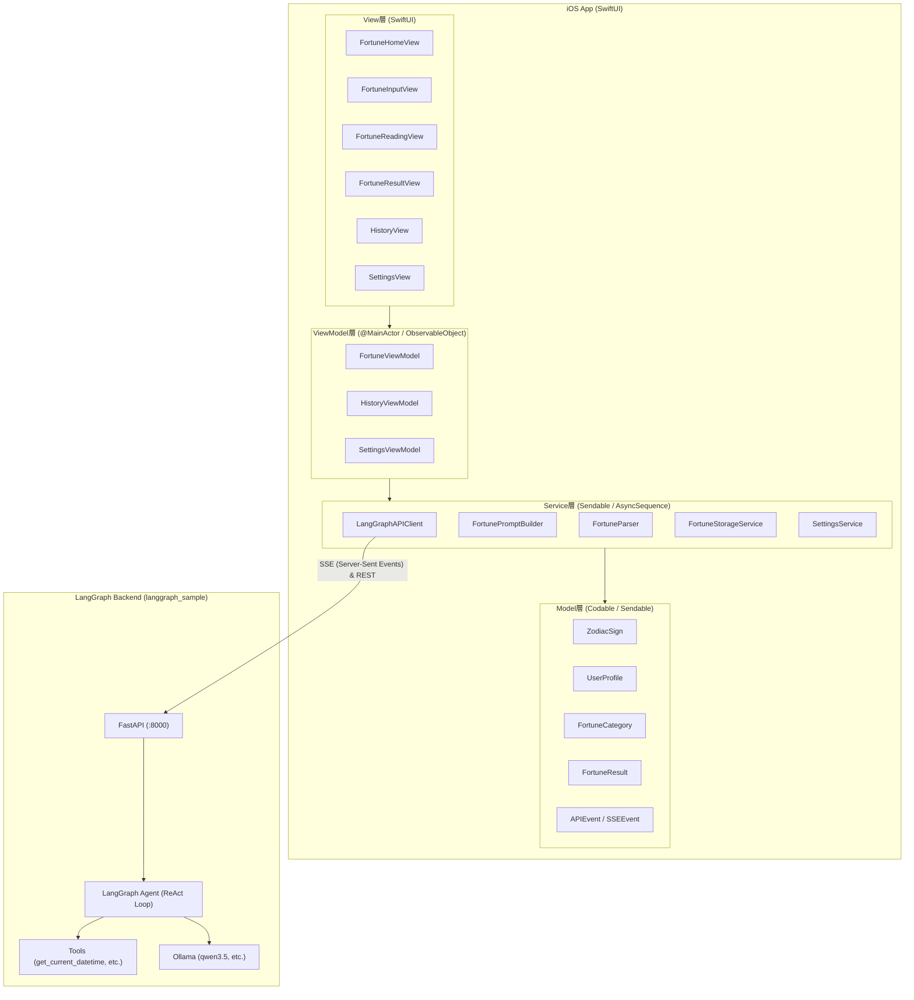
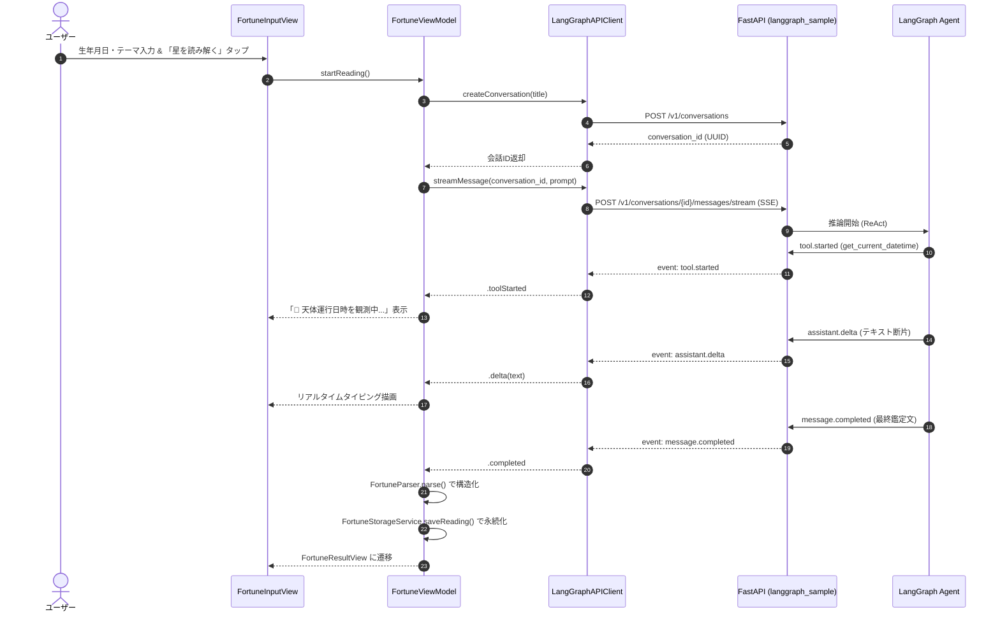

# アーキテクチャ設計書 (Architecture Document)

## 1. 全体構成

Tubeworm は、iOS (SwiftUI) フロントエンドと、ローカルの自律型AIエージェントサーバー（Python + LangGraph + FastAPI + PostgreSQL + Ollama）が HTTP / SSE で通信する疎結合アーキテクチャを採用しています。

---

## 2. レイヤー別責務

### 2.1 Model 層
- **`ZodiacSign`**: 西洋占星術の12星座データ。生年月日から太陽星座を自動判定するほか、エレメント（火・地・風・水）、守護星（ルーラー）、キーワードを保持。
- **`UserProfile`**: ユーザーのニックネーム、生年月日、選択された鑑定カテゴリー、任意の個別質問。
- **`FortuneCategory`**: 鑑定テーマ（総合運、恋愛運、仕事運、金運、対人関係、健康運）。
- **`FortuneResult`**: 鑑定結果データ（運勢スコア、星の神託、ラッキー要素、全文、観測ツール履歴）。
- **`APIEvent`**: FastAPIのレスポンスおよびSSEストリーミングイベントのデコード用データ構造（Swift 6 Sendable 準拠の `AnyCodableValue` を含む）。

### 2.2 Service 層
- **`LangGraphAPIClient`**: 
  - `GET /health`, `GET /ready`: 接続ヘルスチェック
  - `POST /v1/conversations`: 鑑定セッション（会話ID）の発行
  - `POST /v1/conversations/{id}/messages/stream`: `URLSession.AsyncBytes` を利用したSSEストリーミング処理
  - `POST /v1/conversations/{id}/messages`: フォローアップチャットの同期送受信
- **`FortunePromptBuilder`**: 西洋占星術師エージェント「アストリア」に対する精密なプロンプト構築。
- **`FortuneParser`**: LLM出力から正規表現・パターンマッチングでスコア・見出し・ラッキー要素を安全に抽出。
- **`FortuneStorageService`**: 鑑定履歴およびプロフィールの永続化管理（UserDefaults / JSON）。
- **`SettingsService`**: バックエンドURL等の設定管理。

### 2.3 ViewModel 層
- **`FortuneViewModel`**: 鑑定入力・会話作成・SSEストリーミング受信・パース・フォローアップチャットのライフサイクルを統合管理。
- **`HistoryViewModel`**: 過去の鑑定履歴一覧の表示・削除。
- **`SettingsViewModel`**: 接続先URLの変更・即時接続テスト。

### 2.4 View 層
- **`FortuneHomeView`**: 鑑定ステータス（入力待機、接続中、ストリーミング中、結果表示、エラー）に応じた画面切り替え。
- **`FortuneInputView`**: 星座プレビュー付きのプロフィール・相談内容入力画面。
- **`FortuneReadingView`**: 神秘的な星の回転アニメーション、リアルタイムタイピング表示、ツール実行ログ表示。
- **`FortuneResultView`**: 運勢スコア円環ゲージ、ラッキー要素2x2グリッド、バイオリズムバー、全文、追加相談チャット。
- **`HistoryView`**: 過去の鑑定結果一覧と詳細シート表示。
- **`SettingsView`**: 接続設定およびFastAPI起動ガイド表示。
- **`MysticBackground`**: 深藍・パープル・ゴールドの星空グラデーション背景。

---

## 3. 鑑定シーケンス

