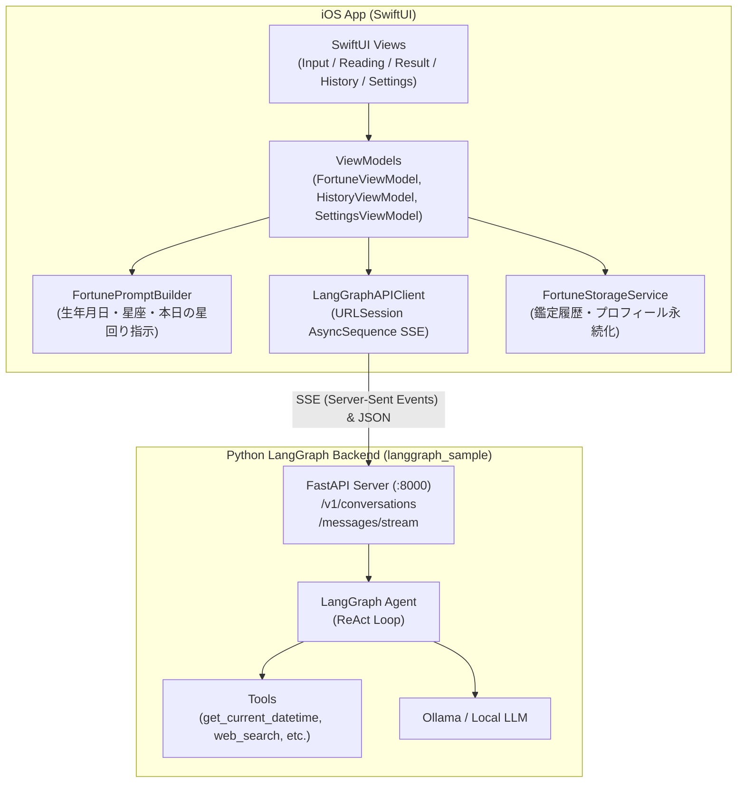

# 実装計画: LangGraphエージェント連携 西洋占星術・運勢鑑定 iOSアプリ (Tubeworm)

## 概要
`/Users/masuda/Projects/langgraph_sample` に構築済みの Python + LangGraph + FastAPI エージェントサーバーをバックエンドとし、生年月日と西洋占星術（ホロスコープ）に基づいてパーソナライズされた運勢鑑定を提供する **SwiftUI iOSアプリ** を新規構築します。

本アプリは、単なる固定テキストや静的APIではなく、自律型AIエージェント（日時の取得ツールや推論ループ）を活用して、本日の日付と星の巡りを踏まえた臨場感あふれる鑑定体験をユーザーに提供します。

---

## システムアーキテクチャ



---

## ユーザー確認事項 (User Review Required)

> [!IMPORTANT]
> **1. バックエンド接続先とApp Transport Security (ATS)**
> ローカルの FastAPI サーバー (`http://127.0.0.1:8000`) とシミュレータまたは実機で通信するため、iOSアプリの `Info.plist` にローカルHTTP通信を許可する `NSAppTransportSecurity` 設定を追加します。実機テスト時は設定画面からMacのローカルIPアドレス（例: `http://192.168.x.x:8000`）へ変更可能です。
>
> **2. プロジェクト生成ツール (XcodeGen)**
> 環境内に `xcodegen 2.46.0` がインストールされているため、再現性が高くクリーンな `project.yml` から `Tubeworm.xcodeproj` を自動生成します。

---

## 設計詳細

### 1. 西洋占星術ロジック (Zodiac Engine)
- 入力された生年月日から12星座を自動判定（牡羊座〜魚座）。
- 星座シンボル、エレメント（火・地・風・水）、支配星（ルーラー）のメタデータを保持。
- 鑑定リクエスト時に、AIエージェントに対して「プロの西洋占星術師」としてのロールプレイ、現在日時（ツールで取得）、天体配置の解釈、総合運・恋愛運・仕事運・ラッキーアイテム・今日のアドバイスを構造化して出力するようプロンプトを注入。

### 2. APIクライアント & SSEストリーミング
- `POST /v1/conversations`: 新しい鑑定セッションを作成。
- `POST /v1/conversations/{id}/messages/stream`: Server-Sent Events (SSE) を購読。
  - `assistant.delta`: リアルタイムに鑑定テキストをUIに反映（タイピング風表示）。
  - `tool.started` / `tool.completed`: 「天体の運行日時を確認中...」など、AIエージェントの思考プロセスをカードで視覚化。
  - `message.completed`: 鑑定完了。結果をパースして各カテゴリーカードに整理。
- `POST /v1/conversations/{id}/messages`: 追加の質問（対話チャット）に対応。

### 3. UI/UXデザイン
- **ミスティック・スターゲイズテーマ**: 深い藍色（Midnight Navy）、パープル、ゴールドのグラデーションによる神秘的な星空ビジュアル。
- **3つのタブ構成**:
  1. **鑑定 (Fortune)**: プロフィール入力・星座プレビュー・鑑定開始・リアルタイム鑑定・結果詳細・追加チャット。
  2. **履歴 (History)**: 過去の鑑定結果一覧と振り返り。
  3. **設定 (Settings)**: バックエンドURL設定・ヘルスチェック（Ollama/FastAPI接続状態確認）・基本プロフィール設定。

---

## 作成・変更ファイル一覧

### 構成設定 & Xcodeプロジェクト
- `project.yml`: XcodeGen 用プロジェクト定義ファイル
- `Info.plist`: ネットワーク通信許可設定など
- `Tubeworm/Assets.xcassets`: アプリアイコン・カラースキーム定義

### Models
- `Tubeworm/Models/ZodiacSign.swift`: 12星座の定義、日付範囲判定、エレメント、シンボル
- `Tubeworm/Models/UserProfile.swift`: ニックネーム、生年月日、星座、関心テーマ
- `Tubeworm/Models/FortuneResult.swift`: 鑑定結果モデル（総合スコア、星の言葉、運気別詳細、ラッキー要素、全文）
- `Tubeworm/Models/FortuneSession.swift`: 履歴保存用セッションデータモデル
- `Tubeworm/Models/APIEvent.swift`: バックエンドSSEイベントのデコード用データ構造

### Services
- `Tubeworm/Services/LangGraphAPIClient.swift`: FastAPI / SSE ストリーミング通信クライアント
- `Tubeworm/Services/FortunePromptBuilder.swift`: 西洋占星術エージェント用プロンプト生成エンジン
- `Tubeworm/Services/FortuneStorageService.swift`: 鑑定履歴とユーザープロフィールの永続化
- `Tubeworm/Services/FortuneParser.swift`: AI出力テキストからスコアやラッキーアイテムを構造化パース

### ViewModels
- `Tubeworm/ViewModels/FortuneViewModel.swift`: 鑑定入力・SSEストリーミング・結果表示・チャットの状態管理
- `Tubeworm/ViewModels/HistoryViewModel.swift`: 鑑定履歴の取得・削除・再表示管理
- `Tubeworm/ViewModels/SettingsViewModel.swift`: サーバー接続確認（`/health`, `/ready`）および設定管理

### Views
- `Tubeworm/App/TubewormApp.swift`: SwiftUI Appエントリーポイント
- `Tubeworm/Views/MainTabView.swift`: メインタブ切り替え
- `Tubeworm/Views/Fortune/FortuneInputView.swift`: 生年月日・プロフィール入力画面
- `Tubeworm/Views/Fortune/ZodiacBadgeView.swift`: 星座アイコン・エレメント表示バッジ
- `Tubeworm/Views/Fortune/FortuneReadingView.swift`: 鑑定中ストリーミング & ツール動作可視化画面
- `Tubeworm/Views/Fortune/FortuneResultView.swift`: 鑑定結果詳細・ラッキー要素・相談チャット画面
- `Tubeworm/Views/History/HistoryView.swift`: 過去の鑑定一覧画面
- `Tubeworm/Views/Settings/SettingsView.swift`: サーバーURL設定 & 接続テスト画面
- `Tubeworm/Views/Components/MysticBackground.swift`: 星空・神秘的グラデーション背景コンポーネント

---

## 検証手順 (Verification Plan)

### 1. プロジェクト生成 & ビルド検証
```bash
# XcodeGenでプロジェクト生成
xcodegen generate

# iOSシミュレータ向けビルド確認
xcodebuild -project Tubeworm.xcodeproj -scheme Tubeworm -destination 'generic/platform=iOS' build
```

### 2. シミュレータ起動 & UI動作確認
```bash
# 起動中シミュレータ (iPhone 17) へのインストールと起動
xcrun simctl install booted Tubeworm.app
xcrun simctl launch booted com.uranai.tubeworm
```

### 3. バックエンド接続 & 鑑定フロー検証
- 設定画面でのヘルスチェック（`GET http://127.0.0.1:8000/health` / `/ready`）の成功表示を確認。
- 生年月日を入力し、星座が自動判定されることを確認。
- 鑑定を実行し、SSEストリーミングによるテキスト流出およびツール実行インジケーターの動作を確認。
- 鑑定完了後にカード型レイアウトで結果が表示され、履歴に保存されることを確認。
