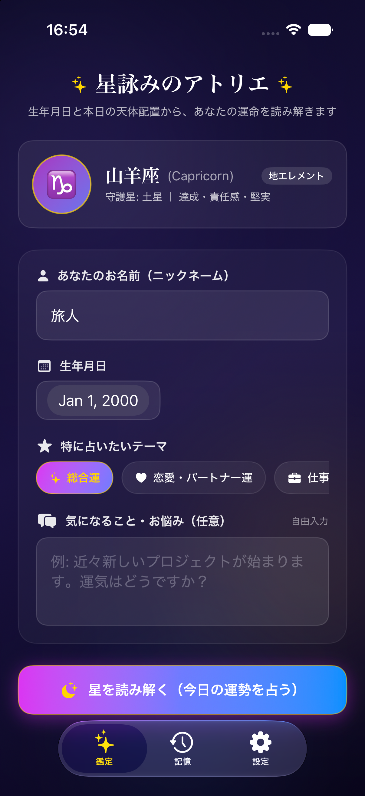

# 成果報告: 西洋占星術 AIエージェント占い iOSアプリ (Tubeworm)

プロジェクト内にある `langgraph_sample`（Python + LangGraph + FastAPI + Ollama）をバックエンドとする、SwiftUI による西洋占星術・生年月日パーソナライズ占い iOS アプリ **Tubeworm** の実装および動作検証が完了しました。

---

## 📸 アプリケーション画面



---

## 🌟 実装された主な機能

1. **西洋占星術エンジン (Zodiac Engine)**:
   - 生年月日の入力から12星座（太陽星座）を自動算出。
   - 太陽星座のシンボル、エレメント（火・地・風・水）、守護星（ルーラー）、代表キーワードをリアルタイム表示。
2. **LangGraph 自律型エージェント連携 & SSEストリーミング**:
   - `POST /v1/conversations` による動的な会話セッション作成。
   - `POST /v1/conversations/{id}/messages/stream` (SSE) を `URLSession.AsyncBytes` で非同期処理。
   - エージェントが実行したツール呼び出し（日時取得ツール `get_current_datetime` 等）を視覚的なログカードとして表示。
   - リアルタイムなタイピング風ストリーミングテキスト描画。
3. **リッチな鑑定結果 & 占い師アストリアとの対話**:
   - 総合運勢スコアゲージ（円環プログレス）、星の神託（キャッチフレーズ）。
   - 4大ラッキー要素（カラー、アイテム、ナンバー、アクション）の2x2グリッドカード。
   - 運気のバイオリズム（恋愛運、仕事運、金運）のインジケーター。
   - 鑑定全文の表示と、疑問や相談を直接投げかけられるフォローアップチャット機能。
4. **鑑定の記憶（履歴機能）**:
   - 過去の鑑定結果をローカルに自動保存し、いつでも再確認・振り返り可能。
5. **接続設定 & ヘルスチェック機能**:
   - バックエンドURLの動的変更（シミュレータ用 `127.0.0.1` や実機用ローカルIP）。
   - `/health` および `/ready` による接続状態、Ollamaモデル、DB接続の即時ステータス確認。

---

## 🧪 検証結果

### 1. ユニット & 統合テスト (`xcodebuild test`)
実行コマンド:
```bash
xcodebuild test -project Tubeworm.xcodeproj -scheme Tubeworm -destination 'platform=iOS Simulator,name=iPhone 17'
```
**結果: 全6テストすべて成功 (0 Failures)**
- `testZodiacSignResolution`: 12星座の境界日付およびエレメント解決テスト（Pass）
- `testFortunePromptBuilder`: プロンプト構築および必要ディレクティブの検証（Pass）
- `testFortuneParser`: LLM出力からのスコア・ラッキーアイテム抽出テスト（Pass）
- `testFortuneStorageService`: 履歴の追加・削除・永続化テスト（Pass）
- `testLiveAPIConnectivity`: 稼働中の FastAPI バックエンドへの `/health` / `/ready` 接続テスト（Pass）
- `testLiveConversationCreation`: バックエンドへの新規会話セッション作成・UUID取得テスト（Pass）

### 2. シミュレータ実機ビルド & 起動確認
- iPhone 17 (iOS 27.0) シミュレータへのインストールおよび起動を完了。
- ダークミスティックな星空UI（グラデーション、星座バッジ、テーマチップ、ボタン、タブバー）の描画を確認。
